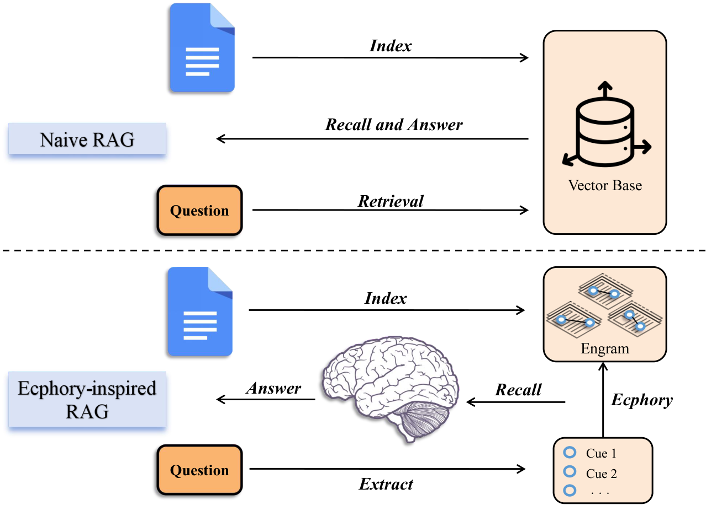
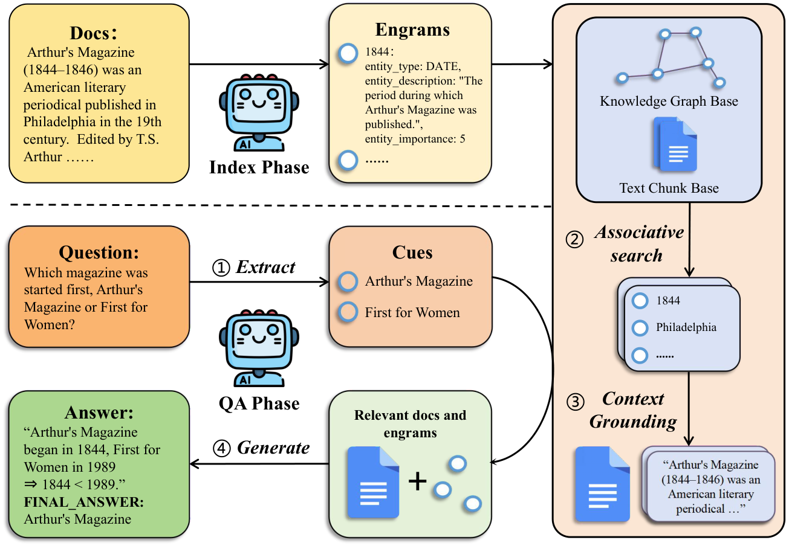
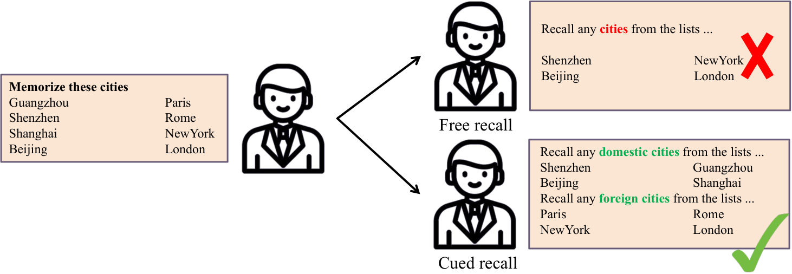
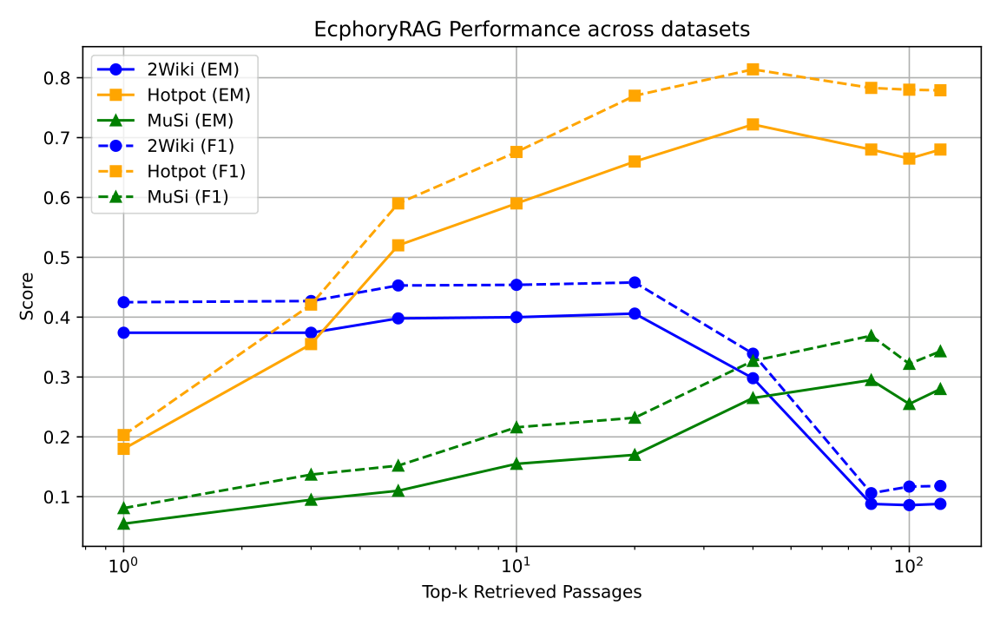
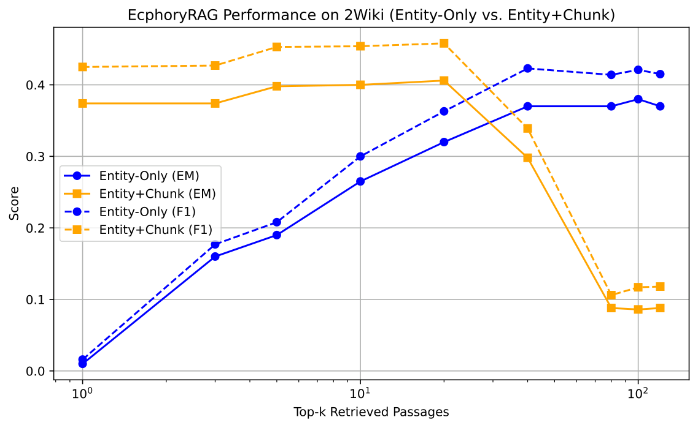

# EcphoryRAG：基于“记忆痕迹（memory traces）”的实体增强检索增强生成（RAG）

This repository provides the official implementation of **EcphoryRAG**, an entity-centric knowledge-graph RAG framework inspired by cue-driven human associative memory for **multi-hop question answering**.

EcphoryRAG 通过“线索（cues）→ 激活实体中心记忆痕迹（engrams）→ 多跳联想检索”的范式完成复杂回忆式推理：在索引阶段仅存储核心实体及其元信息（轻量化 engram），在检索阶段从查询中抽取线索实体并在知识图谱上执行可扩展的多跳联想搜索，同时动态推断实体间隐式关系以补全上下文。我们在多个多跳问答基准上报告了强性能与高效率；与常见基线对比，索引阶段 token 开销最高可降低 94%。

## 摘要（Abstract）

### 中文摘要

认知神经科学研究表明，人类会利用线索（cues）激活以实体为中心的记忆痕迹（engrams），从而完成复杂、多跳的回忆推理。受这一机制启发，我们提出 EcphoryRAG：一种以实体为核心的知识图谱 RAG 框架。在索引阶段，EcphoryRAG 只抽取并存储核心实体及其元信息，以轻量化方式显著降低 token 消耗（相对基线最高可达 94%）。在检索阶段，系统首先从查询中抽取线索实体，然后在知识图谱上进行可扩展的多跳联想检索。关键的是，EcphoryRAG 能够动态推断实体间的隐式关系以补全上下文，从而在无需穷举关系的情况下支持深层推理。我们在 2WikiMultiHop、HotpotQA 与 MuSiQue 基准上进行了广泛评测，结果表明 EcphoryRAG 在多跳问答任务上取得了新的 SOTA，验证了“实体-线索-多跳检索”范式在复杂问答中的有效性。

### English Abstract

Cognitive neuroscience research indicates that humans leverage cues to activate entity-centered memory traces (engrams) for complex, multi-hop recollection. Inspired by this mechanism, we introduce EcphoryRAG, an entity-centric knowledge graph RAG framework. During indexing, EcphoryRAG extracts and stores only core entities with corresponding metadata, a lightweight approach that reduces token consumption by up to 94% compared to baselines. For retrieval, the system first extracts cue entities from queries, then performs a scalable multi-hop associative search across the knowledge graph. Crucially, EcphoryRAG dynamically infers implicit relations between entities to populate context, enabling deep reasoning without exhaustive pre-enumeration of relationships. Extensive evaluations on the 2WikiMultiHop, HotpotQA, and MuSiQue benchmarks demonstrate that EcphoryRAG sets a new state-of-the-art. These results validate the efficacy of the entity-cue-multi-hop retrieval paradigm for complex question answering.

## 主要特性

- **实体中心的轻量化索引（Engrams）**：仅存储核心实体与元信息，显著降低索引 token 开销
- **线索驱动的多跳联想检索**：从查询抽取 cue entities，在知识图谱上执行可扩展 multi-hop associative search
- **隐式关系动态推断**：在不穷举关系的情况下补全上下文，实现更深层推理
- **强性能与高效率**：在 2WikiMultiHop / HotpotQA / MuSiQue 上取得 SOTA，同时在 token 维度具备优势


## 环境与安装

### 依赖

- Python **3.10**（建议）
- [Ollama](https://ollama.ai)（用于本地 LLM 与 embedding 推理）

### 安装步骤

克隆仓库：

```bash
git clone https://github.com/Silent-Rain02/EcphoryRAG.git
cd EcphoryRAG
```

```bash
pip install -r requirements.txt
```

下载（或替换为你实验使用的）Ollama 模型：

```bash
ollama pull bge-m3
ollama pull phi4
```

本项目默认使用 `http://localhost:11434` 作为 Ollama 服务地址；可通过脚本参数 `--ollama-host` 修改。

## 快速开始（建议先跑通子集）

### 1) 运行最小 Demo

```bash
python scripts/run_demo.py
```

### 2) 在仓库自带子集上跑评测

HotpotQA（实体检索 vs. 混合检索）：

```bash
python scripts/run_hotpotqa_evaluation.py --data-path data/processed_hotpotqa/hotpotqa_subset.jsonl --output-dir results/hotpotqa_subset_entity --num-samples 20
python scripts/run_hotpotqa_evaluation.py --data-path data/processed_hotpotqa/hotpotqa_subset.jsonl --output-dir results/hotpotqa_subset_hybrid --enable-hybrid-retrieval --num-samples 20
```

MuSiQue（子集）：

```bash
python scripts/run_musique_evaluation.py --data-path data/processed_musique/musique_subset.jsonl --output-dir results/musique_subset --num-samples 50
```

2WikiMultiHop（子集）：

```bash
python scripts/run_2wiki_evaluation.py --data-path data/processed_2wiki/2wiki_subset.jsonl --output-dir results/2wiki_subset --num-samples 50
```

为避免不同 Shell 的换行符差异（PowerShell/cmd/bash），上面示例命令写成单行。

## 数据集与许可（非常重要）

### 本仓库包含什么数据？

为方便开源复现，本仓库当前包含三份**处理后的子集（subset）**：

- `data/processed_hotpotqa/hotpotqa_subset.jsonl`
- `data/processed_musique/musique_subset.jsonl`
- `data/processed_2wiki/2wiki_subset.jsonl`

它们用于：

- **快速验证代码可运行**（index → retrieve → evaluate）
- **自动化回归检查**（如你后续接入 CI）

这些子集仅用于**复现与演示**，并不代表官方完整数据集分发。若你计划在公开仓库中分发数据（即使是子集），请确保遵守对应数据集的许可条款；若条款不允许再分发，请删除 `data/processed_*/` 下的相关文件，并改为提供下载与处理脚本。

### 是否要上传“处理后的三个完整数据集”？

建议默认**不要直接在 GitHub 仓库里提交完整处理后数据**，而采用以下更稳妥的开源方式：

- **优先保留小规模子集**（用于复现与示例）
- **完整数据**：在 README 中提供**官方来源链接**与**可复现的处理步骤**（见下节）
- 若你确实需要公开完整处理后数据：
  - 先确认 **HotpotQA / MuSiQue / 2WikiMultiHop** 的数据许可是否允许再分发（redistribution）
  - 使用 **GitHub Release / 外部存储（如 Zenodo/OSF）** 发布，并在 README 中给出版本号与校验和（SHA256）

数据集的版权/许可条款以各数据集官方发布为准；使用者需自行遵守对应许可与学术使用规范。

### 从官方数据生成“完整处理后数据”

本仓库提供了数据处理器（`ecphoryrag/data_processing/`）。你可以用以下方式将原始数据转换为本项目的标准 JSONL 格式：

#### 获取原始数据（官方来源）

- HotpotQA：参考 [HotpotQA 官网](https://hotpotqa.github.io/)
- MuSiQue：参考 [MuSiQue 官方仓库](https://github.com/microsoft/MuSiQue)
- 2WikiMultiHop：参考 [2WikiMultiHop 官方仓库](https://github.com/yao8839836/2wikimultihop)

#### HotpotQA → processed JSONL

```bash
python -c "from ecphoryrag.data_processing.hotpotqa_processor import HotpotQAProcessor; HotpotQAProcessor(raw_data_path='data/hotpotqa/hotpotqa_dev.json', output_dir='data/processed_hotpotqa', split_name='dev').process_and_save()"
```

#### MuSiQue → processed JSONL

```bash
python -c "from ecphoryrag.data_processing.musique_processor import MusiqueProcessor; MusiqueProcessor(raw_data_path='data/musique/musique_ans_v1.0_dev.jsonl', output_dir='data/processed_musique', split_name='dev').process_and_save()"
```

#### 2WikiMultiHop → processed JSONL

```bash
python -c "from ecphoryrag.data_processing.two_wiki_processor import TwoWikiProcessor; TwoWikiProcessor(raw_data_path='data/2wiki/raw_data.json', output_dir='data/processed_2wiki', split_name='dev').process_and_save()"
```

如果你要发布处理后数据，建议同时发布处理脚本、版本号、以及处理前原始数据的来源链接与下载日期，保证可追溯性（provenance）。

## 参数与输出

常用参数（以 `scripts/run_hotpotqa_evaluation.py` 为例）：

- `--enable-hybrid-retrieval`：启用混合检索
- `--enable-chunking` / `--chunk-size` / `--chunk-overlap`：控制 chunk 化策略
- `--top-k-final-values`：评测时不同 top-k 的列表（逗号分隔）
- `--retrieval-depth`：二次检索/回溯深度
- `--num-samples`：评测样本数量（留空表示全量）
- `--output-dir`：结果输出目录

结果通常包含：

- `*_evaluation.json`：评测汇总与分项指标
- `usage_stats.json`：token 使用与耗时统计
- `indexing_stats.json`：索引阶段统计（若未跳过索引）

## 可复现性（Reproducibility）

为获得可复现结果，建议在论文/开源说明中固定并记录：

- **Python 版本**、依赖版本（`requirements.txt`）
- **Ollama 模型名称与版本**（建议在实验日志中记录 `ollama list` 输出）
- **随机种子**（如你在实验中使用；当前脚本未统一暴露 seed 参数）
- **运行命令与配置**（将完整命令保存到实验输出目录中）


## 论文配图与表格

### 论文图（Figures）

#### Figure 1：Naive RAG vs. Ecphory-inspired RAG（概念对比）

Figure 1. Naive RAG vs. Ecphory-inspired RAG. 传统 RAG（向量库检索→生成）与 Ecphory 启发的“记忆痕迹召回”范式对比：后者强调基于线索（cues）的联想式检索与回忆（recall）。



#### Figure 2：EcphoryRAG 框架（Index / QA 流程）

Figure 2. EcphoryRAG framework (Index / QA). Index 阶段抽取实体并构建 engrams；QA 阶段从问题中抽取线索，通过联想检索与上下文落地（context grounding）得到证据，再生成答案。



#### Figure 3：动机示意（Free recall vs. Cued recall）

Figure 3. Free recall vs. Cued recall. 无提示的自由回忆（free recall）容易遗漏；加入任务相关线索的提示回忆（cued recall）更稳定、召回更完整，用于启发检索策略设计。



#### Ablation：Top-k



#### Ablation：Text grounding



### 主实验结果（表 1）

Table 1. Comprehensive performance and efficiency comparison on multi-hop QA benchmarks. Results for EcphoryRAG are mean ± std. dev. over 10 runs. Baselines were run once. Bold and underline indicate the best and second-best results, respectively. Efficiency metrics IT and QT are averaged over all datasets.

<table>
  <thead>
    <tr>
      <th rowspan="2">Method</th>
      <th colspan="2">2WikiMultiHop</th>
      <th colspan="2">HotpotQA</th>
      <th colspan="2">MuSiQue</th>
      <th colspan="2">Average Performance</th>
      <th colspan="2">Average Efficiency</th>
    </tr>
    <tr>
      <th>EM</th><th>F1</th>
      <th>EM</th><th>F1</th>
      <th>EM</th><th>F1</th>
      <th>EM</th><th>F1</th>
      <th>IT (Tokens)</th><th>QT (Tokens)</th>
    </tr>
  </thead>
  <tbody>
    <tr>
      <td>Vanilla RAG</td>
      <td>0.360</td><td>0.381</td>
      <td>0.284</td><td>0.325</td>
      <td>0.170</td><td>0.231</td>
      <td>0.271</td><td>0.312</td>
      <td><b>11.2k</b></td><td>848.1k</td>
    </tr>
    <tr>
      <td>LightRAG</td>
      <td>0.130</td><td>0.141</td>
      <td>0.210</td><td>0.233</td>
      <td>0.045</td><td>0.090</td>
      <td>0.128</td><td>0.155</td>
      <td>36.4M</td><td><b>462.9k</b></td>
    </tr>
    <tr>
      <td>HippoRAG2</td>
      <td><u>0.404</u></td><td><b>0.520</b></td>
      <td><u>0.580</u></td><td><u>0.716</u></td>
      <td><u>0.186</u></td><td><u>0.362</u></td>
      <td><u>0.390</u></td><td><u>0.533</u></td>
      <td>6.6M</td><td>832.5k</td>
    </tr>
    <tr>
      <td><b>EcphoryRAG</b></td>
      <td><b>0.406±.004</b></td><td><u>0.454±.005</u></td>
      <td><b>0.722±.006</b></td><td><b>0.814±.004</b></td>
      <td><b>0.295±.005</b></td><td><b>0.369±.006</b></td>
      <td><b>0.475</b></td><td><b>0.547</b></td>
      <td><u>2.0M</u></td><td>1.3M</td>
    </tr>
  </tbody>
</table>

## 伦理与合规（Ethics）

- 本仓库用于研究目的；模型输出可能包含不准确/有偏信息，请勿用于高风险决策场景。
- 若你使用或发布数据，请遵守对应数据集许可、隐私与合规要求，并在论文/README 中明确声明。

## 许可协议（License）

代码采用 **MIT License**，详见 `LICENSE`。

## 致谢（Acknowledgments）

感谢 HotpotQA、MuSiQue 与 2WikiMultiHop 数据集的作者与维护者提供公开基准数据与工具链。

## 论文与引用（Citation）

如果你在研究中使用了本仓库，请引用我们的论文：

- **论文标题**：*EcphoryRAG: Re-Imagining Knowledge-Graph RAG via Human Associative Memory*
- **作者**：Zirui Liao
- **链接**：[arXiv:2510.08958](https://arxiv.org/abs/2510.08958)

BibTeX：

```bibtex
@misc{liao2025ecphoryragreimaginingknowledgegraphrag,
      title={EcphoryRAG: Re-Imagining Knowledge-Graph RAG via Human Associative Memory},
      author={Zirui Liao},
      year={2025},
      eprint={2510.08958},
      archivePrefix={arXiv},
      primaryClass={cs.AI},
      url={https://arxiv.org/abs/2510.08958},
}
```